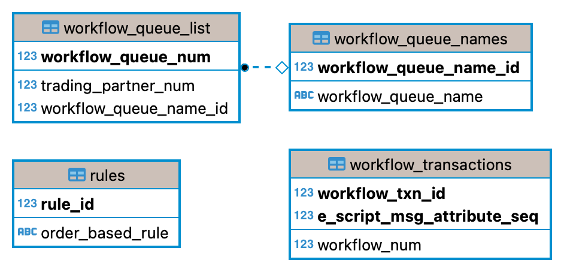
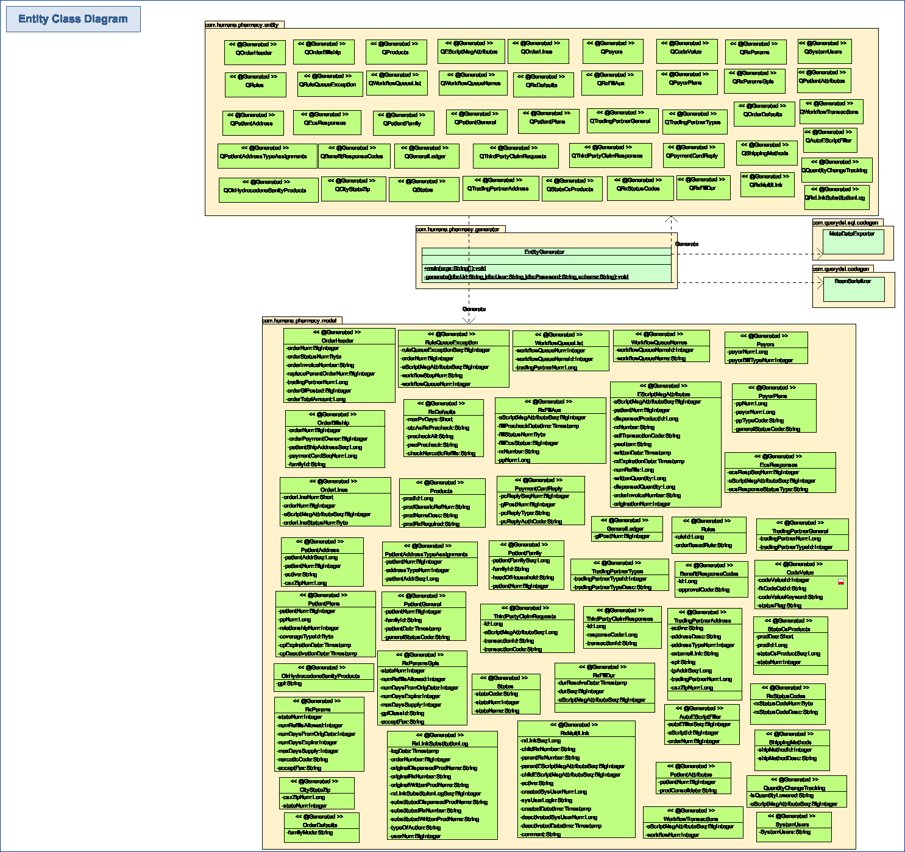
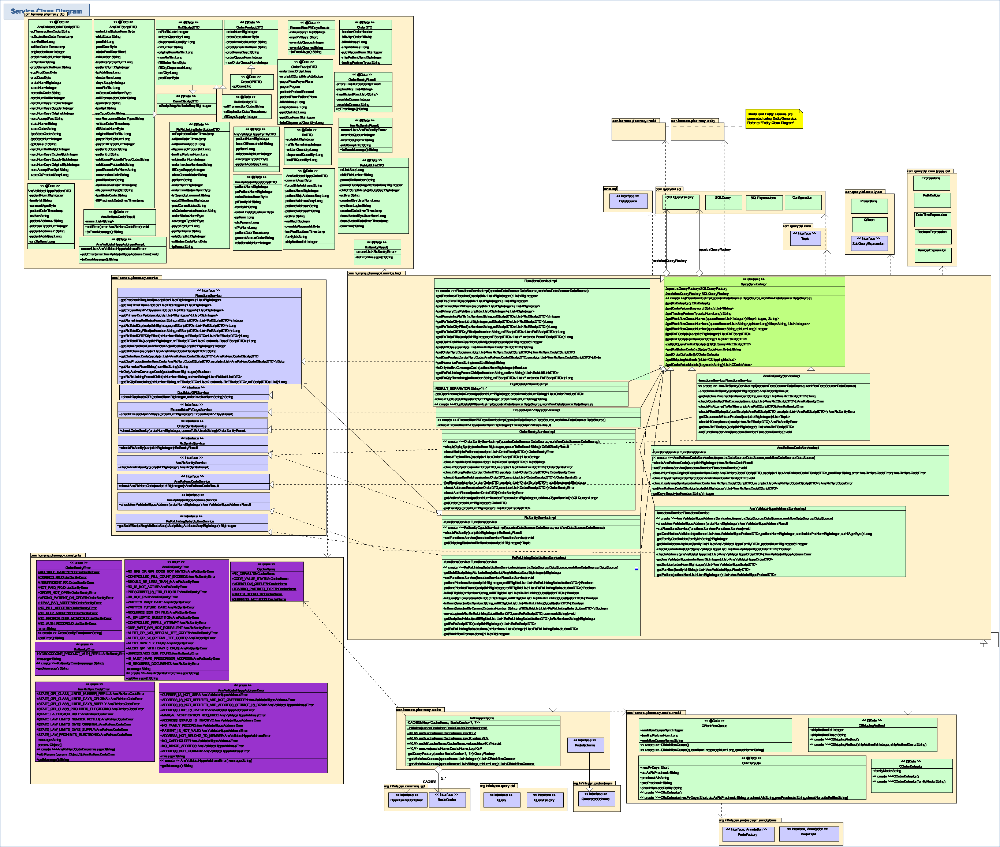

## ePost - Stored procedures migration design

### Tech Stack

- **JDK 8**
- **Querydsl 5.0.0**
- **Infinispan 13.0.10.Final**
- **Junit v5**
- **MS SQL Server 2014 and 2019**

### Description

The goal is to miagrate stored procedures to Java service using Querydsl. Following SPs are migrated:

#### ***P_checkDuplicateGPI***

Duplicate GPI means patient's orders having duplicate products (by checking same prod_generic_ref_num).

It is possible that same prod_generic_ref_num is duplicated within a same order, or duplicated across multiple orders.

It is also possible that not only one prod_generic_ref_num is duplicated, but multiple of them are duplicated.

For example, assuming a patient has 3 orders: Order1, Order2 and Order2:

- Order1 has products [p_num1, p_num1, p_num2, p_num2, p_num3]
- Order2 has products [p_num2]
- Order3 has products [p_num3]

Then duplicate exist:

- p_num1 is duplicated within same Order1
- p_num2 is duplicated within same Order1
- p_num2 is duplicated across Order1 and Order2
- p_num3 is duplicated across Order1 and Order3

#### ***P_ansordersanitycheck3***

This SP is simpler, it's used to check whether order items exceed max PV days from written date for a given order.

#### P_ordersanitycheck

This SP performs multiple checks for a given order, like check order contains multiple patients, check order contains
expired RX, check order contains insufficient RX, check order has invalid ship address, etc.

### OK_rxsanitycheck

This SP has multiple checks for a given Rx. It checks whether the shipping state is OK and Rx number is valid. Once
these conditions are met then it checks whether there are remaining refills greater than 1 in the given error and
returns error if this condition is met.

### P_ansrxsanitycheck

This SP performs multiple checks for a given Ans Rx. It checks whether that rx sig and gpi match prechecked rx, checks
that if controlled, this refill doesn't exceed the number of fills written, checks for the number of refils for
controlled substances does not exceed 5,
checks if rx/doctor is eligible for erx, if so, that we have a doc addr assign to the rx record, checks insure if non
cash plan, claim is paid, checks if script is being filled out more than one year from date written, checks if script
written date is in the future, etc.

### P_ansrxnarccodecheck

This SP performs multiple checks for a given order that haves a narcotic code. It checks whether state restricted GPI,
checks number refills, number days, checks days expire and days supply, fax accepted or not.

### P_ansvalidatehippaadress

This SP figures out correct HIPPA shipping address.

### P_rs_rxlinking_substitution

This SP performs multiple checks for a given ESCRIPT MSG ATTRIBUTE SEQ. It checks whether this ESCRIPT MSG ATTRIBUTE SEQ
will happen Rx linking substitution.

### Databases

There are two SQLServer databases present:

- epostrx ---> All domain tables (Domain table means all other tables except workflow tables)

  

- epostrx_workflow ---> All tables which name contains 'workflow' . In first challenge, we have 'workflow_queue_list'
  and 'workflow_queue_names'.

  

Refer to **db/epostrx.sql** and **db/epostrx_workflow.sql** for the database schemas.

### Implementation

Please refer to **uml/epost.tcuml** for implementation details.

#### Model and Entity



Model and Entity classes are generated using `EntityGenerator`:

- Model classes are generated within `com.humana.pharmacy.model` package.
- Entity classes are generated within `com.humana.pharmacy.entity` package.
- `EntityGenerator` connects to databases and use the database metadata to generate the models and entities.
- `EntityGenerator` is configured in pom.xml so that it can be easily executed using command `mvn exec:java@generate`

#### Service



- `BaseServiceImpl`, contains common methods mostly involved with cache support
- `FunctionsServiceImpl`, provides methods corresponding to original database functions
- `DuplidateGPIServiceImpl`, corresponds to `P_checkDuplicateGPI` SP
- `ExceedMaxPVDaysServiceImpl`, corresponds to `P_ansordersanitycheck3` SP
- `OrderSanityServiceImpl`, corresponds to `P_ordersanitycheck` SP
- `RxSanityServiceImpl` corresponds to `OK_rxsanitycheck` SP
- `AnsRxSanityServiceImpl` corresponds to `P_ansrxsanitycheck` SP
- `AnsRxNarcCodeServiceImpl` corresponds to `P_ansrxnarccodecheck` SP
- `AnsValidateHippaAddressServiceImpl` corresponds to `P_ansvalidatehippaadress` SP
- `RsRxLinkingSubstitutionServiceImpl` corresponds to `P_rs_rxlinking_substitution` SP

### Infinispan Cache

Currently following data are cached:

| Cache Name            | Cache Key                 | Cache Value                      |
| --------------------- | ------------------------- | ---------------------------------|
| RX_DEFAULTS           | "RX_DEFAULTS"             | `CRxDefaults` model              |
| WORKFLOW_QUEUES       | Workflow queue number     | `CWorkflowQueue` model           |
| CODE_VALUE_STATUS     | Code value keyword string | status string                    |
| TRADING_PARTNER_TYPES | Trading partner number    | trading partner type string      |
| RX_STATUS_CODE        | Rx status codes           | rxStatusCodeNum rxStatusCodeDesc |
| ORDER_DEFAULTS        | "ORDER_DEFAULTS"          | `COrderDefaults` model           |
| SHIPPING_METHODS      | "SHIPPING_METHODS"        | `CShippingMethod` model          |

[Infinispan offers two alternative access methods](https://infinispan.org/docs/stable/titles/overview/overview.html#client_server):
embedded mode and client-server mode. This design supports both access modes:

- To use embedded mode, pass an instance of `EmbeddedCacheManager` to `InfinispanCache.initialize()`
- To use client-server mode, pass an instance of `RemoteCacheContainer` to `InfinispanCache.initialize()`

If `InfinispanCache.initialize()` method is not called, it still works as no-op, meaning all query operations will goto
database.

Infinispan has configuration to set expire lifespan and maximum idle
times: https://infinispan.org/docs/stable/titles/configuring/configuring.html#configuring-expiration-for-caches_configuring-memory-usage

For example, let's show how to config an embedded cache and access it:

```xml
<!-- The config file embedded-infinispan.xml -->
<infinispan xmlns="urn:infinispan:config:13.0"
    xmlns:xsi="http://www.w3.org/2001/XMLSchema-instance"
    xsi:schemaLocation="urn:infinispan:config:13.0 https://infinispan.org/schemas/infinispan-config-13.0.xsd">
    <cache-container>
        <local-cache name="RX_DEFAULTS">
            <expiration lifespan="3600000" />
        </local-cache>
        <local-cache name="WORKFLOW_QUEUES">
            <expiration lifespan="3600000" />
        </local-cache>
        <local-cache name="CODE_VALUE_STATUS">
            <expiration lifespan="3600000" />
        </local-cache>
        <local-cache name="TRADING_PARTNER_TYPES">
            <expiration lifespan="3600000" />
        </local-cache>
        <local-cache name="RX_STATUS_CODE">
            <expiration lifespan="3600000" />
        </local-cache>
    </cache-container>
</infinispan>
```

```java
// Create an EmbeddedCacheManager from embedded-infinispan.xml config file
EmbeddedCacheManager manager = new DefaultCacheManager("embedded-infinispan.xml");

// Call InfinispanCache.initialize
InfinispanCache.initialize(manager);

// Create CRxDefaults model
CRxDefaults rxDefaults = new CRxDefaults();
rxDefaults.setMaxPvDays((short) 10);
rxDefaults.setPrecheckAll("Y");
rxDefaults.setPwoPrecheck("N");
rxDefaults.setOtcAsRxPrecheck("Y");

// Put CRxDefaults model to cache
CacheName cacheName = CacheName.RX_DEFAULTS;
String cacheKey = "RX_DEFAULTS";
InfinispanCache.put(cacheName, cacheKey, rxDefaults);

// Get CRxDefaults model from cache
CRxDefaults cached = InfinispanCache.get(cacheName, cacheKey);
System.out.println(cached);
```

### Table Hint

To follow the original SP behavior, the table hint `WITH (NOLOCK)` should be appended after table name in sql query. For
example:

```sql
select ... 
from table1 WITH (NOLOCK)
join table2 WITH (NOLOCK)
on table1.column1=table2.column1
```

To do that, call `addJoinFlag(" WITH (NOLOCK) ", JoinFlag.Position.BEFORE_CONDITION)` after each `from(...)`
and `join(...)`. For example, assuming in design the querydsl code is written like:

```java
workflowQueryFactory
    .select(...)
    .from(table1)
    .join(table2)
    .on(table1.column1.eq(table2.column1))
    .fetch();
```

Then to add table hint it should be:

```java
workflowQueryFactory
    .select(...)
    .from(table1).addJoinFlag(" WITH (NOLOCK) ", JoinFlag.Position.BEFORE_CONDITION)
    .join(table2).addJoinFlag(" WITH (NOLOCK) ", JoinFlag.Position.BEFORE_CONDITION)
    .on(table1.column1.eq(table2.column1))
    .fetch();
```

### Performance

Performance is important for this challenge and is subject to review.

- Only return necessary columns in select statement

- Only make necessary calls to database. E.g. if no orders found, then no need to get workflow queues of orders

- Reduce the number of calls to database. E.g. use sql **IN (...)** clause for batch query, instead of query them one by
  one

- Use concurrent async calls to database if there existed independent query.

  E.g. in the `OrderSanityServiceImpl.checkOrderSanity` method, the methods to get order and escripts are independent,
  they could be implemented using  `CompletableFuture`:

  ```java
  // Get order
  CompletableFuture<OrderDTO> orderFuture = CompletableFuture.supplyAsync(() -> getOrder(orderNum));
  
  // Get escripts
  CompletableFuture<List<OrderEscriptDTO>> escriptsFuture = CompletableFuture.supplyAsync(() -> getEscripts(orderNum));
  
  OrderDTO order = orderFuture.join();
  List<OrderEscriptDTO> escripts = escriptsFuture.join();
  ```

You are encouraged to improve performance by reforming the sql query and java data structure from design. If you see any
chance to improve, don't hesitate to do it.

### Tests

Tests are required for all services and Infinispan cache.

- `InfinispanCache` should cover all methods.
  - Should verify embedded access mode work.
  - Should verify client-server access mode work.
- `BaseServiceImpl` should cover all methods.

- `FunctionsServiceImpl` should cover all methods.

- `DuplidateGPIServiceImpl` should cover the cases:

  	- When no duplicate found
    - When duplicates exist within same order
    - When duplicates exist across multiple orders
    - When orders are in workflow queue


- `ExceedMaxPVDaysServiceImpl` should cover the cases:

  	- When none order items exceed max PV days
    - When there are order items exceed max PV days

- `OrderSanityServiceImpl` should cover the cases:

  	- When order contains more than one member
    - When order contains expired Rx
    - When order contains Rx has insufficient quantity to fill
    - When order contains RXs without a paid ecs status
    - When order is not opened
    - When order contains wrong patient member not in same family
    - When order contains HIPAA ship-to violation
    - When order has no valid bill address
    - When order has no valid ship address
    - When order has no proper ship member
    - When order has no auth record

- `RxSanityServiceImpl` should cover following cases:
    - When scriptId is not passed then checkRxSanity function should IllegalArgumentException
    - When shipping state of a scriptId is OK
    - When Rx number is not available
    - When RsSanityResult contains HYDROCODONE_PRODUCT_WITH_REFILLS error
    - When RxSanityResult doesn't contains error.

- `AnsRxSanityServiceImpl` should cover following cases:
    - When scriptId is not passed then checkRxSanity function should IllegalArgumentException
    - When shipping state of a scriptId is OK
    - When Rx number is not available
    - When RsSanityResult contains RX_SIG_OR_GPI_DOES_NOT_MATCH error.
    - When RxSanityResult doesn't contains error.
    - When RsSanityResult contains CONTROLLED_FILL_COUNT_EXCEEDS error.
    - When RxSanityResult doesn't contains error.
    - When RsSanityResult contains SHOULD_BE_LESS_THAN_6 error.
    - When RxSanityResult doesn't contains error.
    - When RsSanityResult contains RX_IS_NOT_ACTIVE error.
    - When RxSanityResult doesn't contains error.
    - When RsSanityResult contains PRESCRIBER_IS_ERX_ELIGIBLE error.
    - When RxSanityResult doesn't contains error.
    - When RsSanityResult contains WRITTEN_PAST_DATE error.
    - When RxSanityResult doesn't contains error.
    - When RsSanityResult contains WRITTEN_FUTURE_DATE error.
    - When RxSanityResult doesn't contains error.
    - When RsSanityResult contains REQUIRES_SSN_ON_FILE error.
    - When RxSanityResult doesn't contains error.
    - When RsSanityResult contains FL_EPILEPTIC_SUBSTITION error.
    - When RxSanityResult doesn't contains error.
    - When RsSanityResult contains CONTROLLED_REFILL_ATTEMPT error.
    - When RxSanityResult doesn't contains error.
    - When RsSanityResult contains DISP_WRIT_GPI_NOT_EQUIVILENT error.
    - When RxSanityResult doesn't contains error.
    - When RsSanityResult contains ALERT_GPI_WO_SPECIAL_TEE_CODES error.
    - When RxSanityResult doesn't contains error.
    - When RsSanityResult contains ALERT_GPI_W_SPECIAL_TEE_CODES error.
    - When RxSanityResult doesn't contains error.
    - When RsSanityResult contains ALERT_DAW_1_2_DRUG error.
    - When RxSanityResult doesn't contains error.
    - When RsSanityResult contains ALERT_GPI_WITH_DAW_8_DRUG error.
    - When RxSanityResult doesn't contains error.
    - When RsSanityResult contains UNRESOLVED_DUR_FOUND error.
    - When RxSanityResult doesn't contains error.
    - When RsSanityResult contains HI_MUST_HAVE_PRESCRIBER_ADDRESS error.
    - When RxSanityResult doesn't contains error.
    - When RsSanityResult contains HI_REQUIRES_DOCUMENTS error.
    - When RxSanityResult doesn't contains error.

- `AnsRxNarcCodeServiceImpl` should cover following cases:
    - When scriptId is not passed then checkAnsRxNarcCode function should raise IllegalArgumentException.
    - When check narcotic code of a scriptId is OK.
    - When AnsRxNarcCodeResult contains STATE_GPI_CLASS_LIMITS_NUMBER_REFILLS error.
    - When AnsRxNarcCodeResult doesn't contains error.
    - When AnsRxNarcCodeResult contains STATE_GPI_CLASS_LIMITS_DAYS_ORIGINAL error.
    - When AnsRxNarcCodeResult doesn't contains error.
    - When AnsRxNarcCodeResult contains STATE_GPI_CLASS_LIMITS_DAYS_SUPPLY error.
    - When AnsRxNarcCodeResult doesn't contains error.
    - When AnsRxNarcCodeResult contains STATE_GPI_CLASS_PROHIBITS_ELECTRONIC error.
    - When AnsRxNarcCodeResult doesn't contains error.
    - When AnsRxNarcCodeResult contains STATE_LA_DOCTOR_RULE error.
    - When AnsRxNarcCodeResult doesn't contains error.
    - When AnsRxNarcCodeResult contains STATE_LAW_LIMITS_NUMBER_REFILLS error.
    - When AnsRxNarcCodeResult doesn't contains error.
    - When AnsRxNarcCodeResult contains STATE_LAW_LIMITS_DAYS_ORIGINAL error.
    - When AnsRxNarcCodeResult doesn't contains error.
    - When AnsRxNarcCodeResult contains STATE_LAW_LIMITS_DAYS_SUPPLY error.
    - When AnsRxNarcCodeResult doesn't contains error.
    - When AnsRxNarcCodeResult contains STATE_LAW_PROHIBITS_ELECTRONIC error.
    - When AnsRxNarcCodeResult doesn't contains error.

- `AnsValidateHippaAddressServiceImpl` should cover following cases:
    - When orderNum is not passed then checkAnsValidateHipaaAddress function should raise IllegalArgumentException.
    - When forceShipAddress is "Y" then return null.
    - When familyMode is "Y" but no family id, then function should raise RuntimeException.
    - When AnsValidateHippaAddressResult contains CURRIER_IS_NOT_USPS error.
    - When AnsValidateHippaAddressResult contains ADDRESS_IS_NOT_VERIFIED_AND_NOT_OVERRIDDEN error.
    - When AnsValidateHippaAddressResult contains STATE_GPI_CLASS_LIMITS_DAYS_SUPPLY error.
    - When AnsValidateHippaAddressResult contains ADDRESS_IS_NOT_VERIFIED_AND_ADDRESS_SERVICE_IS_DOWN error.
    - When AnsValidateHippaAddressResult contains ADDRESS_LINE_IS_OVERED error.
    - When AnsValidateHippaAddressResult contains MANUAL_VERIFICATION_REQUIRED error.
    - When AnsValidateHippaAddressResult contains ADDRESS_STATUS_IS_INACTIVE error.
    - When AnsValidateHippaAddressResult contains NO_FAMILY_RECORD error.
    - When AnsValidateHippaAddressResult contains PATIENT_IS_NOT_VALID error.
    - When AnsValidateHippaAddressResult contains NO_CARDHOLDER error.
    - When AnsValidateHippaAddressResult contains NO_MINOR_ADDRESS error.
    - When AnsValidateHippaAddressResult contains ADDRESS_NOT_COMMON error.
    - When AnsValidateHippaAddressResult doesn't contains error.

- `RsRxLinkingSubstitutionServiceImpl` should cover following cases:
    - When eScriptMsgAttributeSeq is not passed then getSubEScriptMsgAttributeSeq function should raise
      IllegalArgumentException.
    - When EdiTransactionCode is 'NEWRX' and FILL_DAYS_SUPPLY is 90
    - When EdiTransactionCode is 'REFILLRX' and FILL_DAYS_SUPPLY is 90 and refillremaining > 0
    - When Rx number has been quantity lowered in current or immediate previous fill.
    - When Rx number has already been selected to be filled.
    - When Rx number is not eligible for Refill.
    - When Rx number has already been selected to be filled on the current order
    - When Patient Plan Information not found on profile
    - When Patient Plan is INACTIVE
